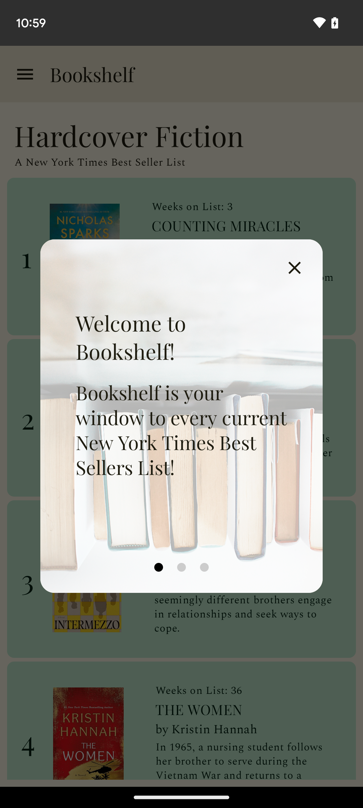
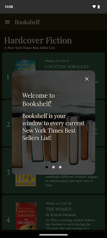
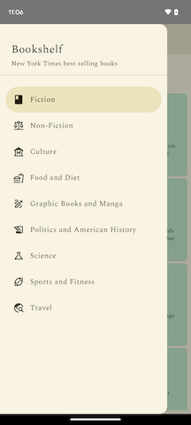
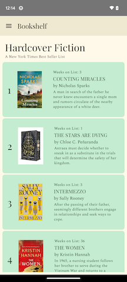
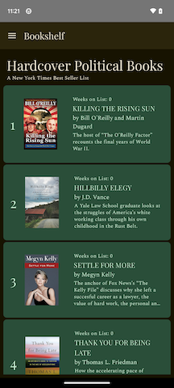

# Bookshelf

**Bookshelf** is your window into the Best Seller Lists of the New York Times. This app uses the New York Times Books API to retrieve the latest books on the most popular Best Seller lists: Fiction, Nonfiction, Culture, Food & Diet, Graphic Books & Manga, Politics & American History, Science, Sports & Fiteness, and Travel. 

## Welcome
A welcome screen introduces the User to the app and gives them simple information about what to expect. This dialog utilizes a horizontal pager that allows the User to swipe through three pages of information. Clicking out of this dialog triggers a change in a preference that indicates to the app whether to show or not show this information. 

## Navigation
A navigation drawer gives you access to all of the lists. Clicking on any of them navigates you to a list view of Best Selling Books for that subject. 

## Lists
The Compose Lazy List that displays on the BookshelfListScreen is populated with the latest NYT data with a network call that also saves the data to a local Room Database. This screen shows a CircularProgressIndicator while the loading is happening. 

The items in the list get their data (title, author, image, etc) from the network call response, which is parsed into an Entity that the Room Database can handle and the UI can use. Clicking on any item navigates the User to a detail screen.

## Book Details
The BookReviewScreen is the detail view which gets some of its data passed from the List screen and some from a separate network call to the Review API. Additional information is seen here such as ranking info, publisher, description of the book, and links (if they exist) for a book review and an amazon link). These links open in a browser window.

## Architecture, Frameworks, & Libraries
The Architecture that I chose was the popular MVVM pattern. The layers include PRESENTATION (Composables, ViewModel), DOMAIN, and DATA (Local, Remote). I have interfaces that define the contract that the implementation classes in the next layer must adhere to. Within the DATA layer is a repository implementation as well as LocalDataSource and RemoteDataSource interfaces and implementations.

Dependency Injection is handled by Koin, an open-source Kotlin-based Dependency Injection framework. The dependency graph is located in the AppModule, which is started in the app's Application class.

Remote calls are handled by Ktor, a Jetbrains kotlin-based HTTP client that retrieves the current data from the NYT Books API. The Moshi library is used to parse the network calls into local objects.

Local Data is handled by a Room Database, complete with two DAO classes that define all interactions between the app and the database. For preferences (in this app, a Boolean regarding whether the User has seen the onboarding dialog introducting the app) I used Preferences DataStore.

## UI
**Bookshelf** uses Jetpack Compose to create the UI and handle State. Some Composables have been separated out into components for reusability/readability. I also used the Coil library to load book images and the latest type-safe Compose Navigation library for navigation purposes.

App theming is implemented with light and dark theme color schemes. Colors have been carefully chosen for Accessibility (contrast) and design considerations. Colors and Typography were integrated into the theming using components that evoke the New York Times qualities of authority, trustworthiness, and tradition.

## Instructions for running Bookshelf
After opening the app with an IDE (I used Android Studio Jellyfish), make sure these settings are used: Java 17, Gradle Plugin Version 8.4.0, and Gradle Version 8.6.

